<h1 align="center">
    
</h1>

### A student passionate about Software Engineering.
- 🎓 Master's Student in Information Management (Wirtschaftsinformatik) @ Universität Klagenfurt  
- 💻 Mainly coding in C# and Java
- 💻 Currently exploring React & TypeScript
- 📫 Reach me via [LinkedIn](https://www.linkedin.com/in/hoffmann-thomas/)

## 🛠️ Languages and Tools

 

  
    
  

## ⚡️ Stats
 

  
  
   
  

## 🐍 My Contributions

  <picture>
    <source media="(prefers-color-scheme: dark)" srcset="https://raw.githubusercontent.com/hoffmann2109/hoffmann2109/output/github-contribution-grid-snake-dark.svg" />
    <source media="(prefers-color-scheme: light)" srcset="https://raw.githubusercontent.com/hoffmann2109/hoffmann2109/output/github-contribution-grid-snake.svg" />
    
  </picture>

<!--
**hoffmann2109/hoffmann2109** is a ✨ _special_ ✨ repository because its `README.md` (this file) appears on your GitHub profile.

Here are some ideas to get you started:

- 🔭 I’m currently working on ...
- 🌱 I’m currently learning ...
- 👯 I’m looking to collaborate on ...
- 🤔 I’m looking for help with ...
- 💬 Ask me about ...
- 📫 How to reach me: ...
- 😄 Pronouns: ...
- ⚡ Fun fact: ...
-->
